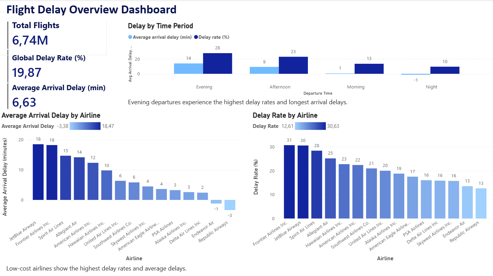
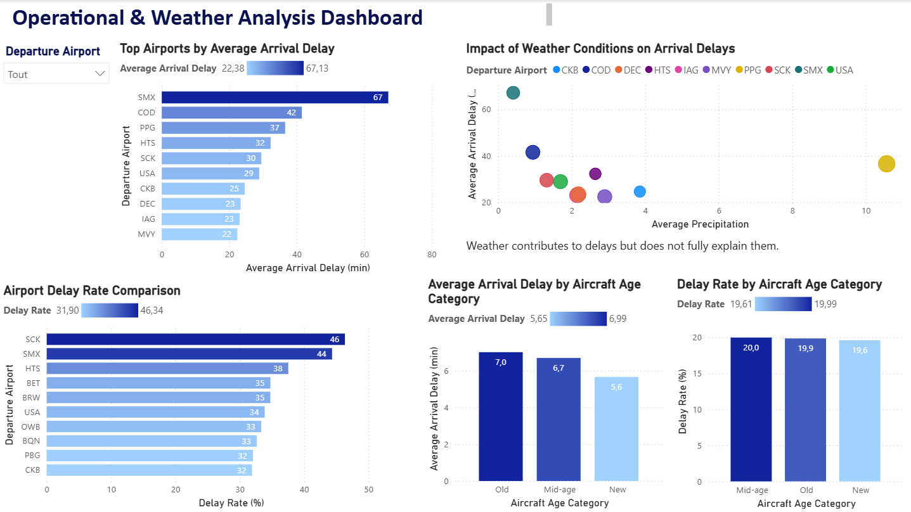

# ✈️ Flight Delay & Risk Intelligence Pipeline

## 📌 Project Overview

This project is an end-to-end Data Engineering and Analytics pipeline built around US flight operations data. The goal is to analyze flight delays, identify operational risk patterns, and create interactive business dashboards for airline performance monitoring.

The pipeline processes more than **6.7 million flight records** and combines:

- Flight operations data
- Airport information
- Weather conditions

The project follows a modern **Bronze / Silver / Gold** architecture and includes data cleaning, feature engineering, KPI generation, and Power BI dashboards.

---

## 🏗️ Architecture

```text
Raw Data
   ↓
Bronze Layer
   ↓
Data Cleaning & Validation
   ↓
Silver Layer
   ↓
Feature Engineering & Aggregations
   ↓
Gold Layer (Business KPIs)
   ↓
Power BI Dashboards
```

---

## 📂 Project Structure

```text
flight_delay_intelligence_pipeline/
│
├── data/
│   ├── raw/
│   ├── bronze/
│   ├── silver/
│   └── gold/
│
├── dashboards/
│   ├── Flight Delay Overview Dashboard.png
│   ├── Operational & Weather Analysis Dashboard.png
│   └── flight_delay_dashboard.pbix
│
├── scripts/
│   ├── extract.py
│   ├── transform.py
│   ├── analyze.py
│   └── load.py
│
├── main.py
├── requirements.txt
├── .gitignore
└── README.md
```

---

## ⚙️ Technologies Used

- Python
- Pandas
- NumPy
- Parquet
- Power BI
- Git & GitHub

---

## 📊 Datasets

The project uses multiple datasets related to US civil aviation operations.

### Main datasets

- US Flights 2023
- Airports Geolocation Data
- Weather Data by Airport

### Data volume

- 6.7M+ flight records
- 364 airports
- 132k+ weather records

> ⚠️ Large raw datasets are not included in the repository due to GitHub file size limitations.

---

## 🔄 Pipeline Workflow

### 1. Extract

Raw CSV datasets are loaded using Pandas.

### 2. Transform

Data cleaning and preprocessing:

- Null handling
- Duplicate removal
- Date conversion
- Data type optimization

### 3. Feature Engineering

New analytical features were created:

- Delay severity categories
- Delay flags
- Aircraft age categories
- Operational KPIs

### 4. Load

Processed datasets are stored as:

- Bronze Layer
- Silver Layer
- Gold Layer

using the Parquet format.

---

## 📈 Key Business Insights

### ✈️ Airline Performance

- Low-cost airlines show the highest delay rates and average delays.
- JetBlue and Frontier Airlines experience the worst operational performance.

### ⏰ Time-Based Delays

- Evening departures experience the highest delay rates and longest arrival delays.
- Night departures are generally the most stable.

### 🌦️ Weather Impact

- Weather contributes to delays but does not fully explain them.
- Some airports experience high delays despite low precipitation levels.

### 🛫 Airport Congestion

- Certain airports consistently experience significantly higher operational delays.

### 🛩️ Aircraft Reliability

- Older aircraft show slightly higher average delays compared to newer aircraft.

---

## 📊 Power BI Dashboards

The project includes two interactive dashboards.

### ✈️ Flight Delay Overview Dashboard

Provides:

- Global KPIs
- Airline performance analysis
- Delay trends by departure period

### 🌦️ Operational & Weather Analysis Dashboard

Provides:

- Weather impact analysis
- Airport congestion analysis
- Aircraft reliability insights

---

## 📸 Dashboard Preview

### ✈️ Flight Delay Overview Dashboard



---

### 🌦️ Operational & Weather Analysis Dashboard



---

## 🚀 Future Improvements

Potential next steps for the project:

- Cloud storage integration (AWS S3)
- Apache Spark migration
- Airflow orchestration
- Real-time flight monitoring
- Machine Learning delay prediction models

---

## ▶️ How to Run the Project

### Clone repository

```bash
git https://github.com/JihaneKarroum/flight-delay-intelligence-pipeline.git
```

### Install dependencies

```bash
pip install -r requirements.txt
```

### Run pipeline

```bash
python main.py
```

---

## 👤 Author

**Jihane Karroum**

Data Engineering & Analytics Project